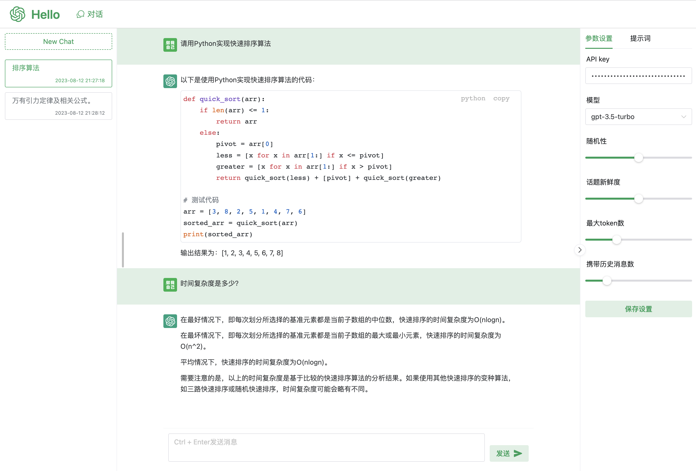

<!--
 * @Descripttion: 
 * @version: 
 * @Date: 2023-07-27 19:40:33
 * @LastEditTime: 2023-08-12 21:33:10
-->
# chat-web
一个简单的chat-web



## 技术栈
- 语言：TypeScript
- 构建工具：vite
- 框架：vue3
- UI： naive UI
- 状态管理: Pinia
- 路由：vue-router
- SSE： microsoft/fetch-event-source

## 本地运行
```shell
# 依赖安装
pnpm install

# 运行
pnpm run dev

# 打包
pnpm run build
```

## docker运行
```shell
# 构建镜像
docker build -t chat-web:v1 .

# 运行
docker run --name chat-web -d -p 3000:3000 chat-web:v1

## 或者使用构建好的镜像
docker run --name chat-web -d -p 3000:3000 pipiya/chat-web:v1
```